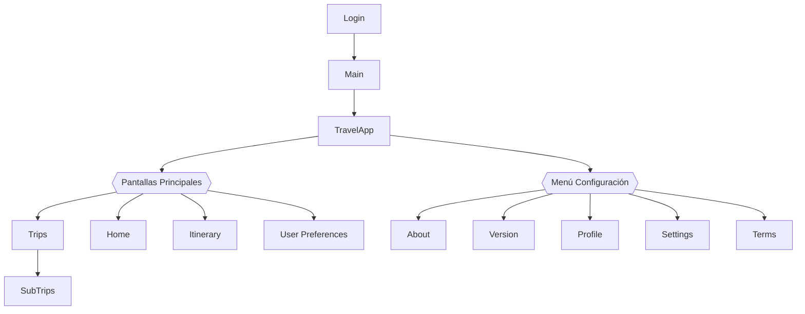
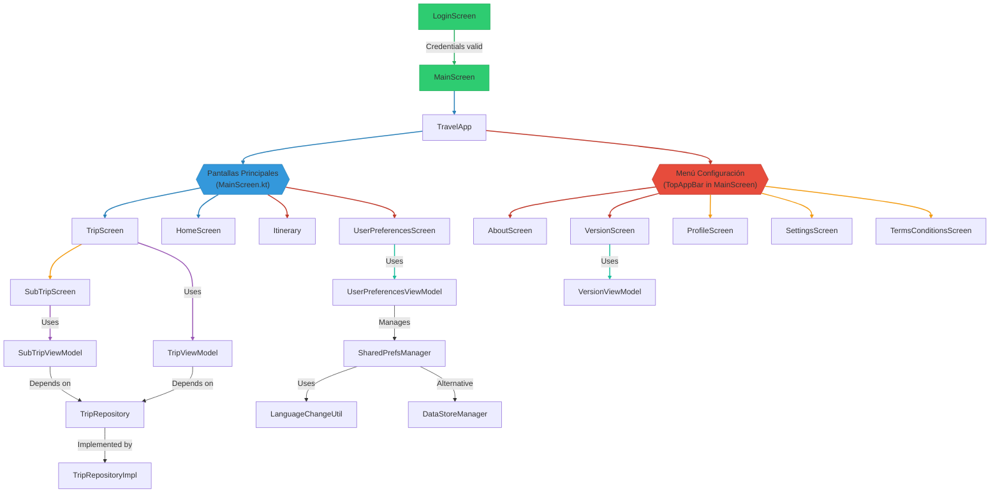
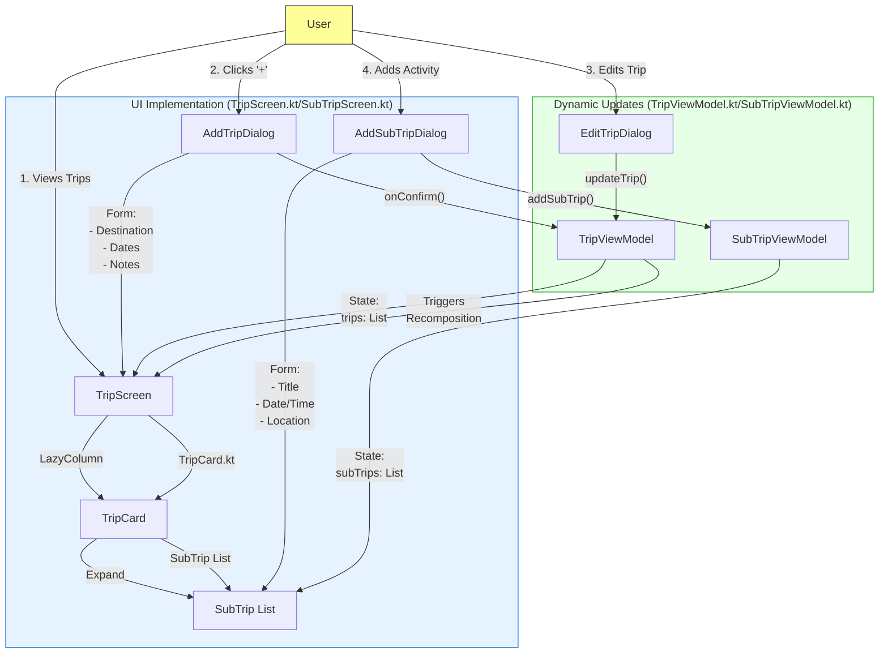

# TravelWorld - Documentación Completa

## Key Features:
1. **4 Pantallas Principales**:
    - Viajes (Trips)
    - Inicio (Home)
    - Itinerario (Itinerary)
    - Preferencias (User Preferences)

2. **Menú de Configuración con 5 opciones**:
    - About (información de la app)
    - Version (detalles de versión)
    - Profile (gestión de usuario)
    - Settings (configuración general)
    - Terms & Conditions (legal)

3. **Flujo de Navegación**:
    - Login → Main (Home) → (4 pantallas principales)
    - Acceso directo a SubTrips desde Trips
    - Menú desplegable con 5 opciones de configuración

Implementation Notes:
T2.1 User Interaction (From TripScreen.kt):

Users see trips in a LazyColumn 

Each TripCard is expandable to show SubTrip list

FloatingActionButton triggers AddTripDialog 

T2.2 UI Flow:

// From TripScreen.kt
AddTripDialog(
    onDismiss = { showDialog = false },
    onConfirm = { newTrip ->
        viewModel.addTrip(newTrip) // Updates state
    }
)
T2.3 Dynamic Updates:

// TripViewModel.kt
fun addTrip(trip: Trip) {
    _trips.add(trip)
    // Automatically triggers recomposition
}
Data Validation (From SubTripScreen.kt lines 130-160):

Date/time format checking

Required field validation

Error message display
