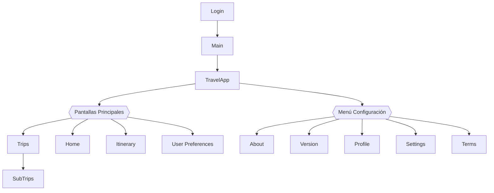
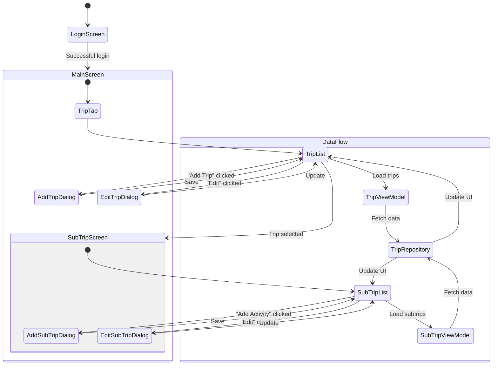
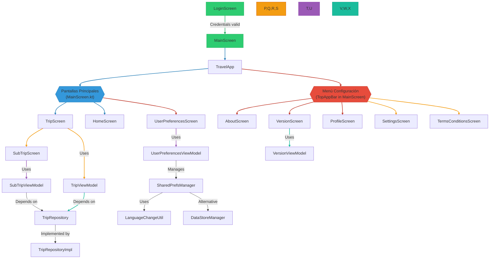

# TravelWorld - Documentación Completa

## Key Features:
1. **4 Pantallas Principales**:
    - Viajes (Trips)
    - Inicio (Home)
    - Itinerario (Itinerary)
    - Preferencias (User Preferences)

2. **Menú de Configuración con 5 opciones**:
    - About (información de la app)
    - Version (detalles de versión)
    - Profile (gestión de usuario)
    - Settings (configuración general)
    - Terms & Conditions (legal)

3. **Flujo de Navegación**:
    - Login → Main (Home) → (4 pantallas principales)
    - Acceso directo a SubTrips desde Trips
    - Menú desplegable con 5 opciones de configuración

