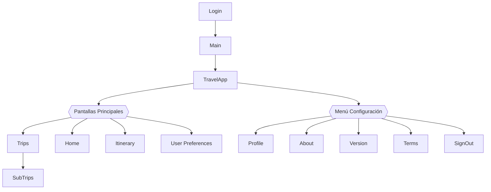
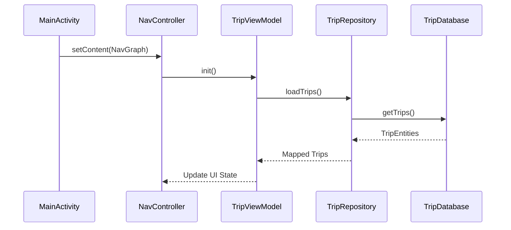
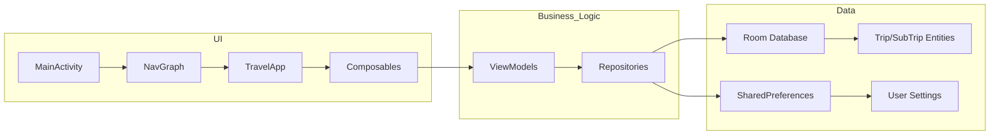
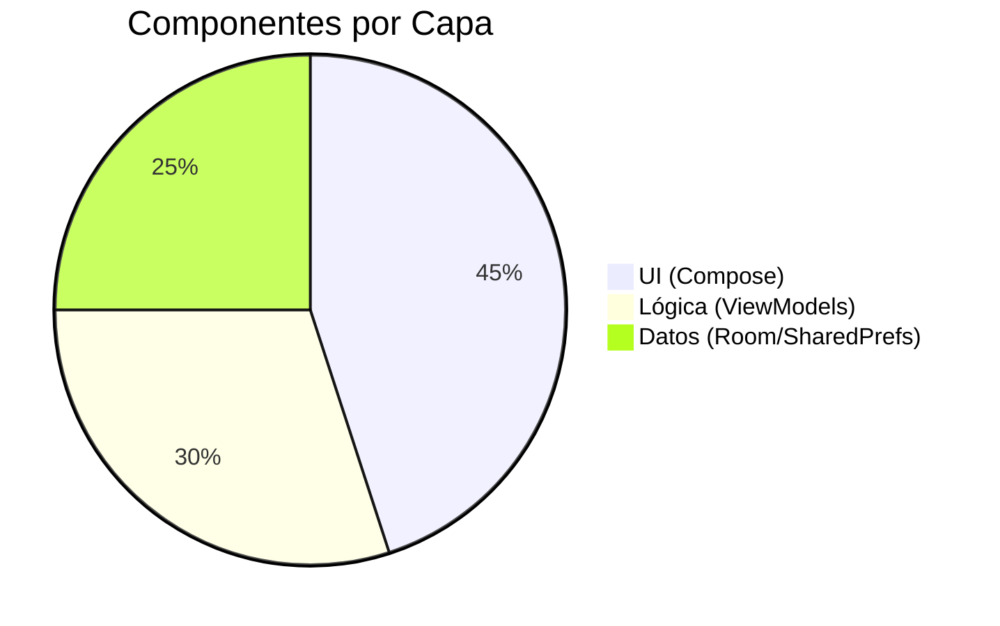
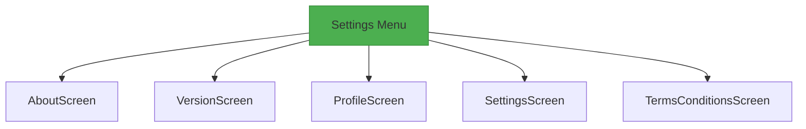

# TravelWorld - Documentación Completa



```mermaid
classDiagram
    direction BT
    
    class MainActivity {
        +onCreate()
    }
    
    class NavGraph {
        +composable("login")
        +composable("main")
        +composable("subtrips")
        +composable("about")
        +composable("terms")
        +composable("version")
        +composable("settings")
    }
    
    class TravelApp {
        +selectedScreen: TravelMode
        +showSettingsMenu: Boolean
    }
    
    class TravelMode {
        <<enumeration>>
        HOME
        TRIP
        ITINERARY
        USER_PREFERENCE
    }
    
    class TripViewModel {
        -repository: TripRepository
        +trips: StateFlow~List~Trip~~
        +addTrip(Trip)
        +deleteTrip(Int)
    }
    
    class UserPreferencesViewModel {
        -sharedPrefsManager: SharedPrefsManager
        +darkThemeEnabled: Boolean
        +language: String
        +updateLanguage(String)
    }
    
    MainActivity --> NavGraph
    NavGraph --> TravelApp
    TravelApp --> TripViewModel
    TravelApp --> UserPreferencesViewModel
    UserPreferencesViewModel --> SharedPrefsManager
    TripViewModel --> TripRepository
    TripRepository <|.. TripRepositoryImpl
    TripRepositoryImpl --> TripDatabase
    TripDatabase --> Trip
    Trip --> SubTrip
```mermaid
erDiagram
    TRIP ||--o{ SUBTRIP : contains
    
    TRIP {
        int id PK
        string title
        string description
        datetime created_at
    }
    
    SUBTRIP {
        int id PK
        int parentTripId FK
        string title
        string description
    }
```









## Key Features:
1. **4 Pantallas Principales**:
   - Viajes (Trips)
   - Inicio (Home)
   - Itinerario (Itinerary)
   - Preferencias (User Preferences)

2. **Menú de Configuración con 5 opciones**:
   - About (información de la app)
   - Version (detalles de versión)
   - Profile (gestión de usuario)
   - Settings (configuración general)
   - Terms & Conditions (legal)

3. **Flujo de Navegación**:
   - Login → Main (Home) → (4 pantallas principales)
   - Acceso directo a SubTrips desde Trips
   - Menú desplegable con 5 opciones de configuración

4. **Persistencia de Datos**:
   - Room Database para Trips/SubTrips
   - SharedPreferences para configuración de usuario
   - Integración con Hilt para DI
